## Setup

In this section, we will setup VPC and other related resources manually.

We will show other approach using IaaC later.

### Create VPC and more

Search for `VPC` to go to VPC dashboard.

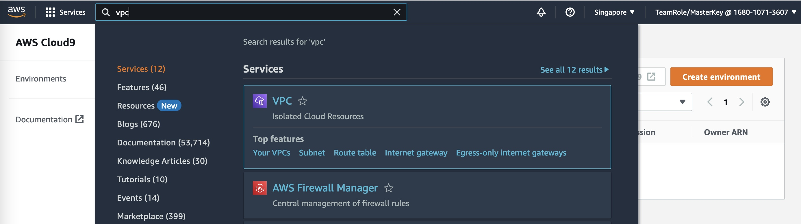

Click `Create VPC` button

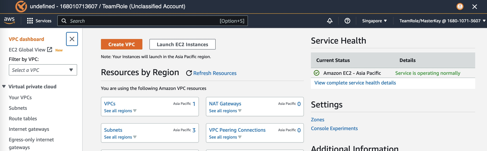

Let's name it `odoo` and set IP CIDR to `10.1.0.0/16`

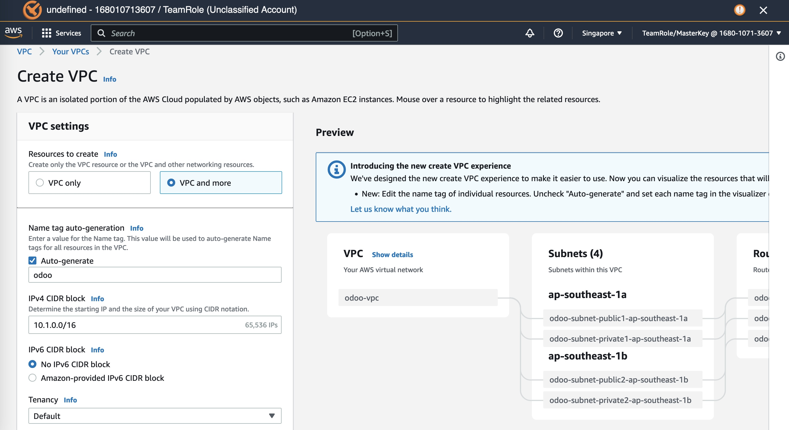

VPC will span 2 AZs. each AZ will have 1 public subnets, 2 private subnets, and 1 NAT Gateway.

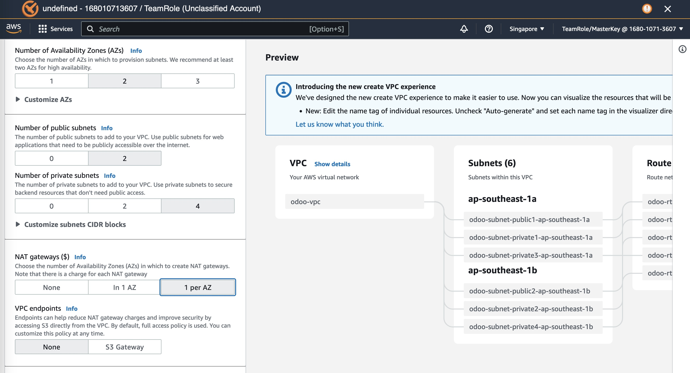

Can preview

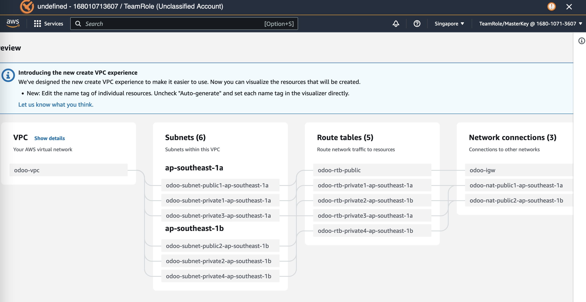

Then click `Create VPC` button

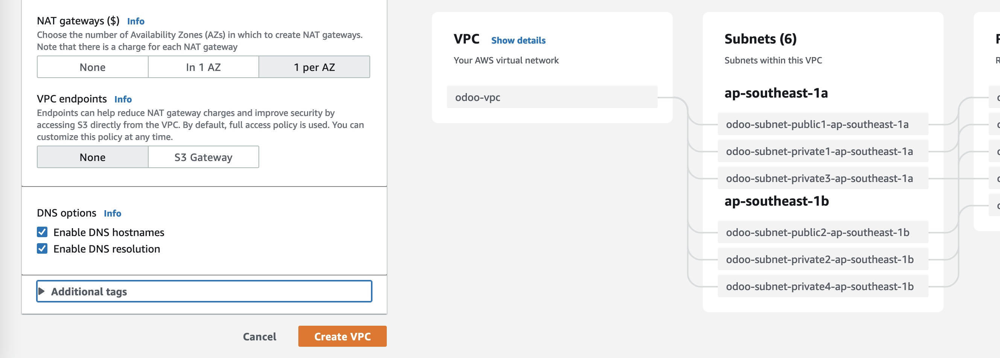

Wait until all resources are created

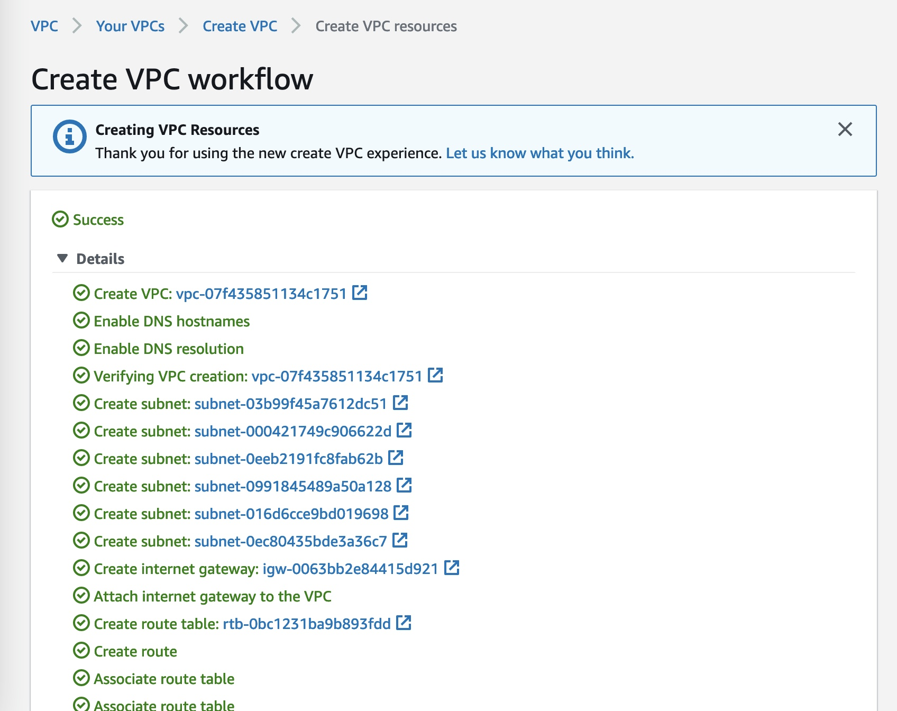

Can click left side menu. e.g. `VPC` menu.

or `Subnets` etc.

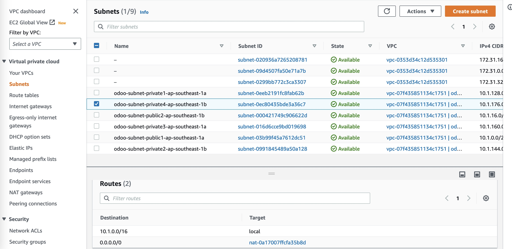

### Modify Turn Some Private to Isolated Subnets

In this case, we want to turn `private3` and `private4` subnets into isolated subnets (i.e. `isolated1` and `isolated2`).

So, `private1` and `private2` subnets can reach internet via NAT Gateway while `isolated1` and `isolated2` subnets can't.

Let's rename subnets accordingly

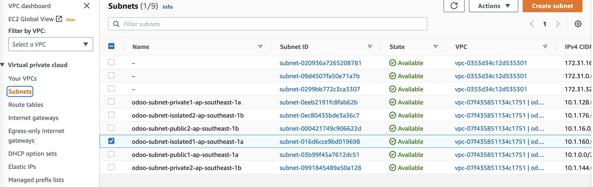

rename route tables as well

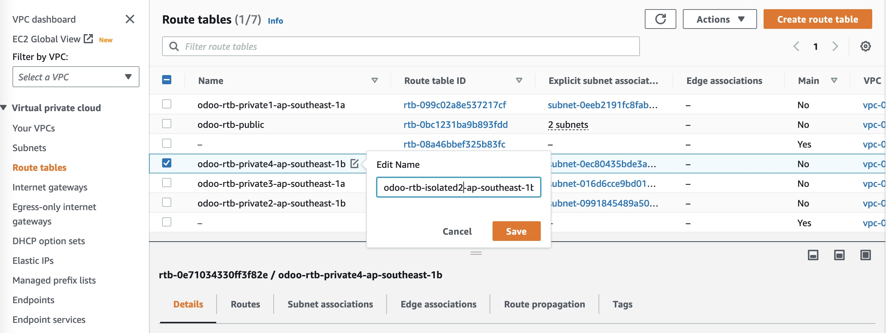

select the isolated route table and click `edit routes`

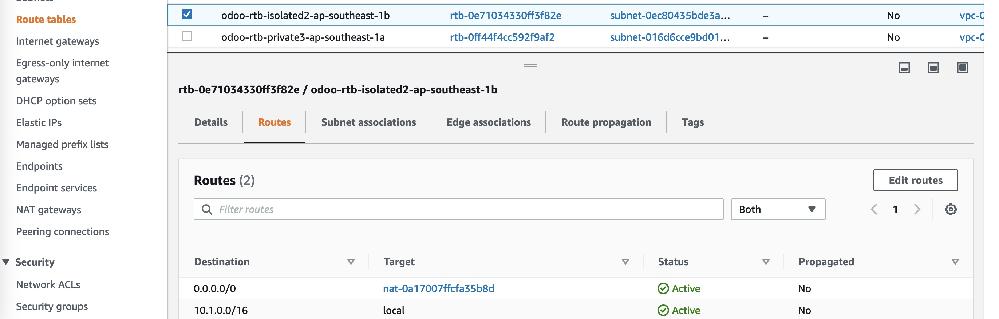

remove route to NAT GW

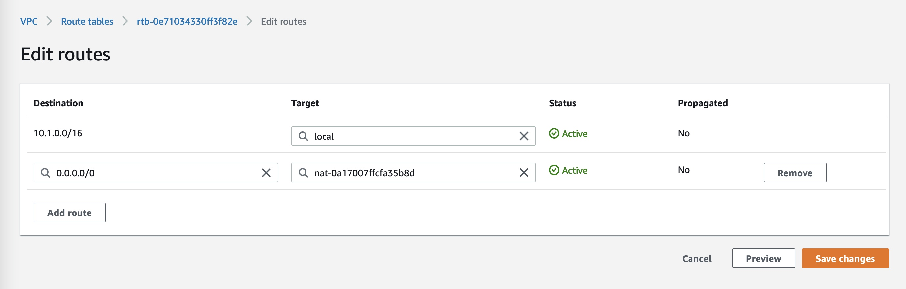

save change

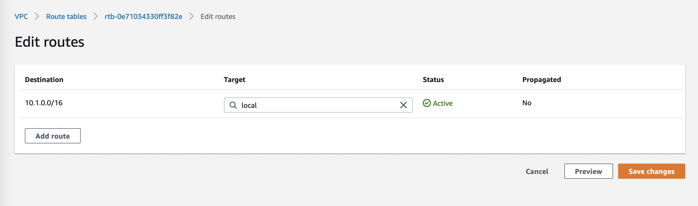
