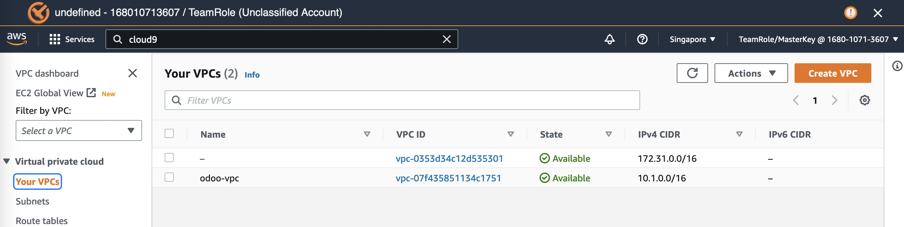
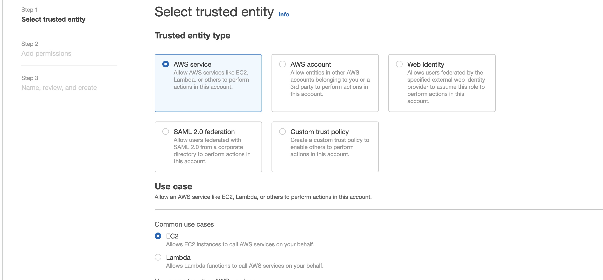
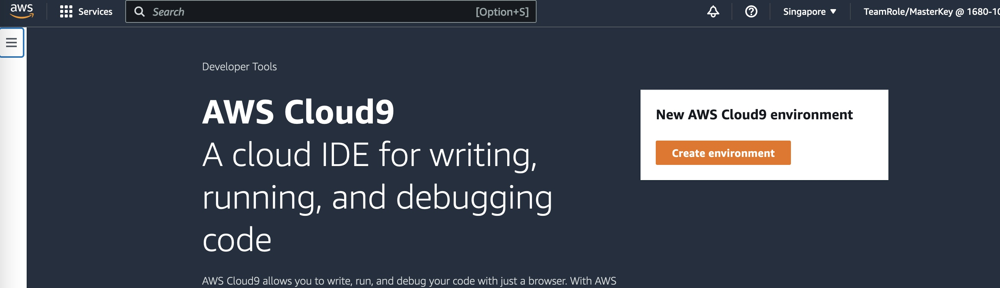
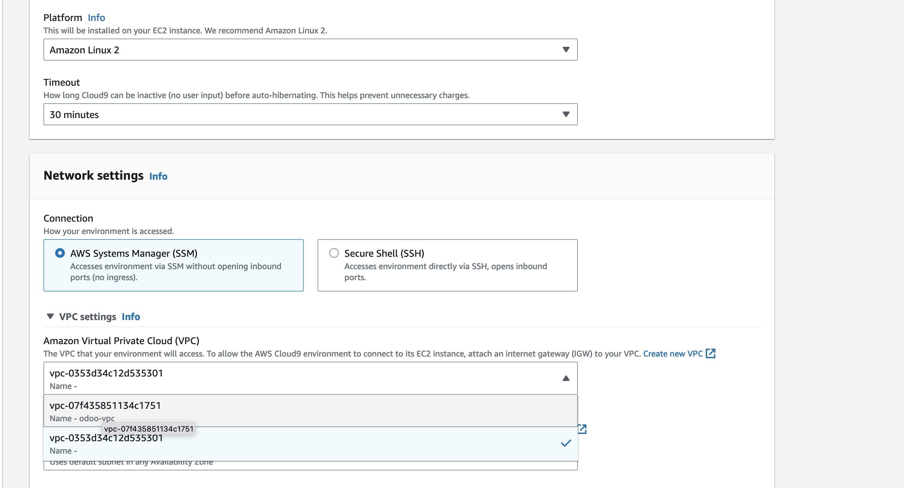
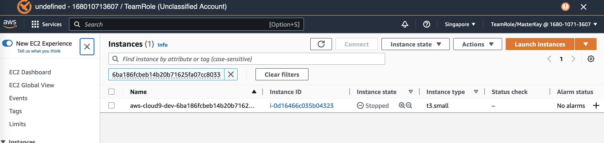
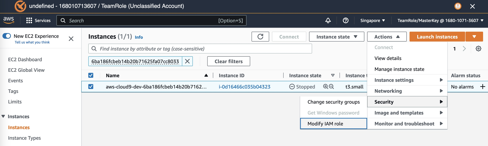

## Setup

In this section, we will setup VPC and other related resources manually.

We will show other approach using IaaC later.

### Create VPC and more

Search for `VPC` to go to VPC dashboard.

Click `Create VPC` button

Let's name it `odoo` and set IP CIDR to `10.1.0.0/16`

VPC will span 2 AZs. each AZ will have 1 public subnets, 2 private subnets, and 1 NAT Gateway.

Can preview

Then click `Create VPC` button

Wait until all resources are created

Can click left side menu. e.g. `VPC` menu.

or `Subnets` etc.

### Modify Turn Some Private to Isolated Subnets

In this case, we want to turn `private3` and `private4` subnets into isolated subnets (i.e. `isolated1` and `isolated2`).

So, `private1` and `private2` subnets can reach internet via NAT Gateway while `isolated1` and `isolated2` subnets can't.

Let's rename subnets accordingly

rename route tables as well

select the isolated route table and click `edit routes`

remove route to NAT GW

save change

### Prepare IAM Roles for Cloud9 to Access Services

Go to `IAM` console. Select `Role` on the left menu. Then click `Create Role` button

Select `AWS Service` and for `EC2` use case.

Search permission policy `AdministratorAccess` and tick the checkbox.

### Create Cloud9

Go to `Cloud9` console

Click `Create Environment`

Choose EC2 instance type. `t3.small` is good enough

Put it in our newly created VPC

Use one of our private subnets

Click `Create` button

Once created, click `open`

It will run the instance

Back to the `cloud9` console, click name to see detail page

Click `Manage EC2 Instance`

New tab to `EC2` will be opened, click the checkbox

Select from dropdown menu `Action` -> `Security` -> `Modify IAM Role`

Select IAM role we just created in previous step from dropdown menu.

Click `Update IAM Role`

