## Setup

In this section, we will setup Cloud9 environment.

### Prepare IAM Roles for Cloud9 to Access Services

Go to `IAM` console. Select `Role` on the left menu. Then click `Create Role` button

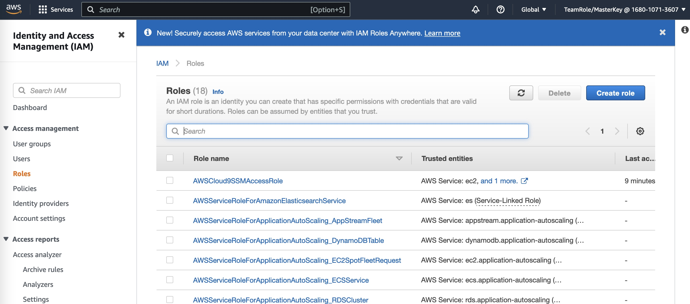

Select `AWS Service` and for `EC2` use case.

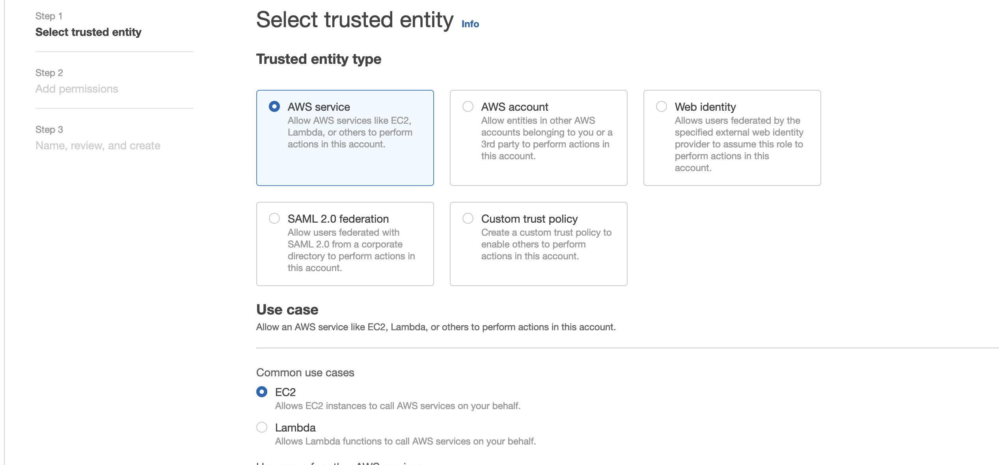

Search permission policy `AdministratorAccess` and tick the checkbox.

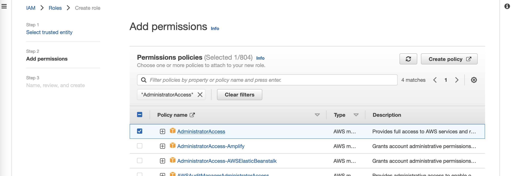


### Create Cloud9

Go to `Cloud9` console

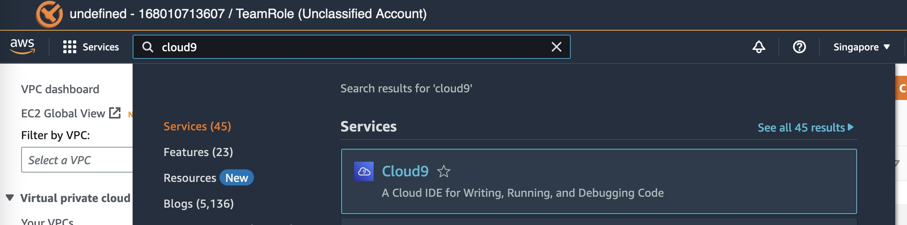

Click `Create Environment`

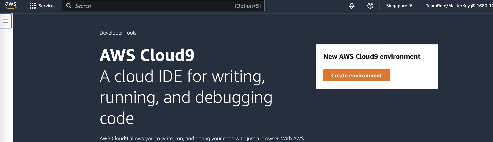

Choose EC2 instance type. `t3.small` is good enough

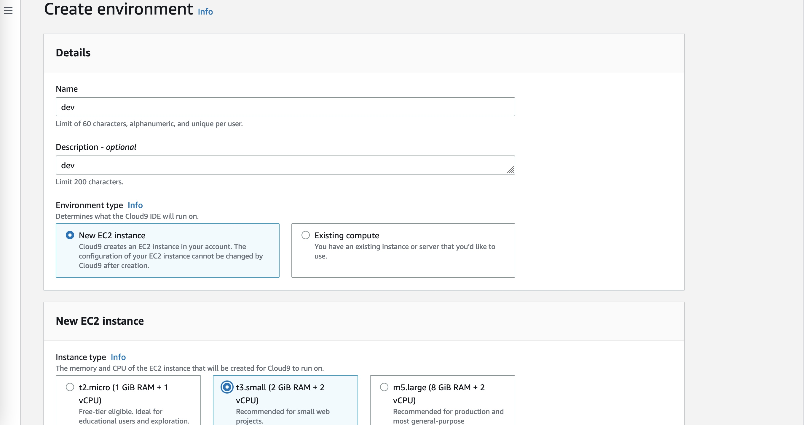

Put it in our newly created VPC

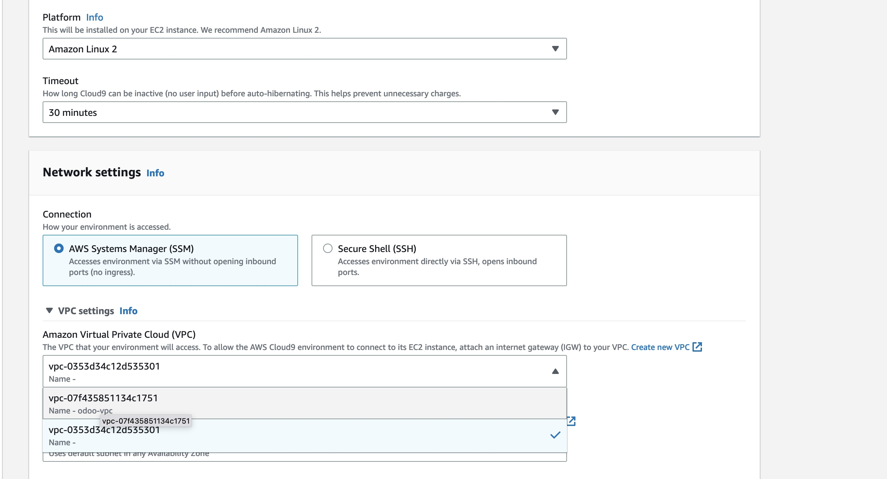

Use one of our private subnets

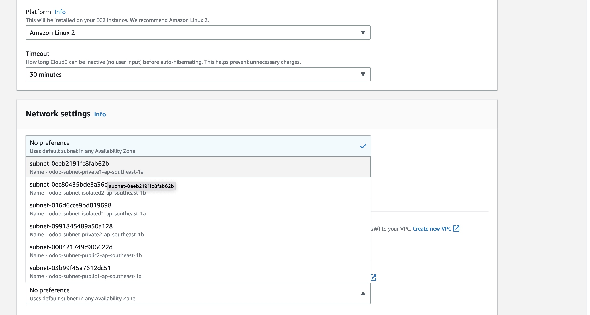

Click `Create` button

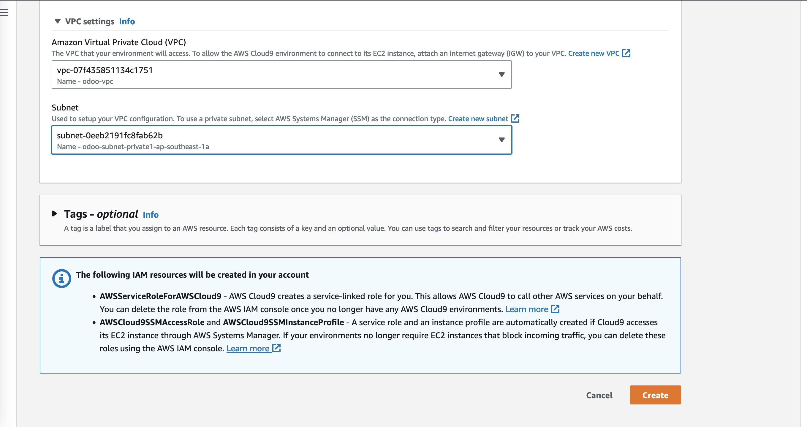

Once created, click `open`

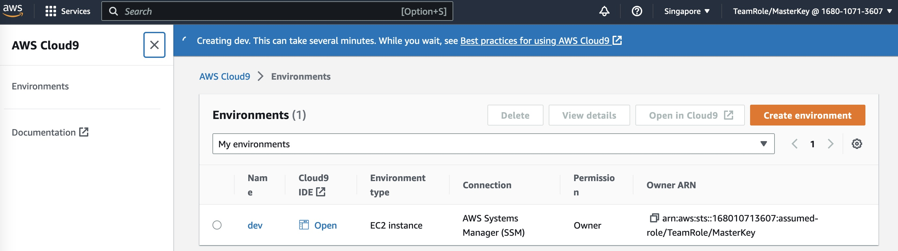

It will run the instance

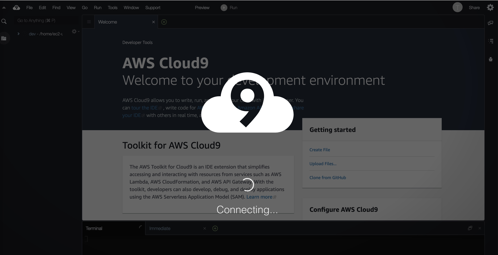

Back to the `cloud9` console, click name to see detail page


Click `Manage EC2 Instance`

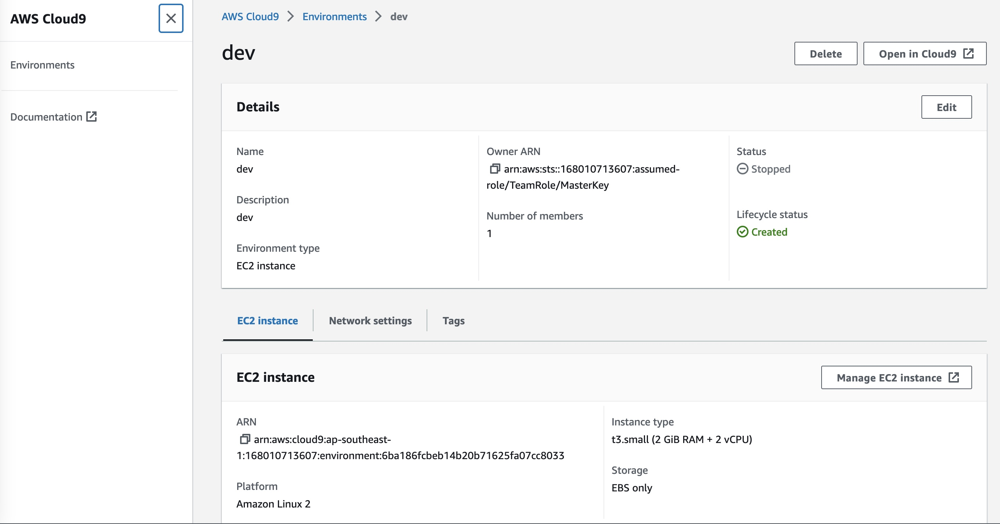

New tab to `EC2` will be opened, click the checkbox

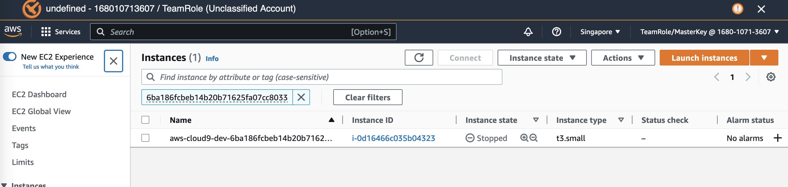

Select from dropdown menu `Action` -> `Security` -> `Modify IAM Role`

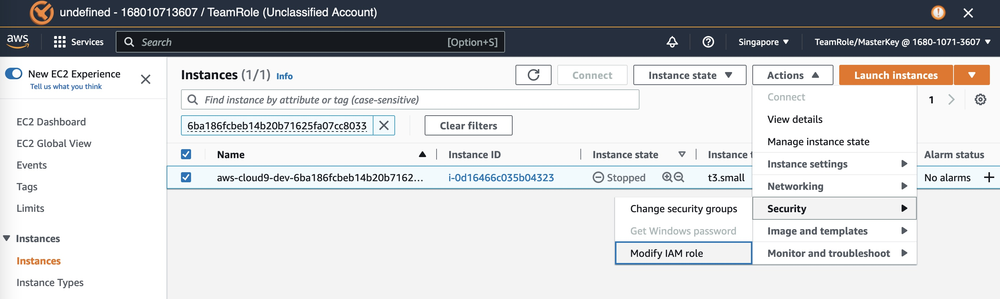

Select IAM role we just created in previous step from dropdown menu.

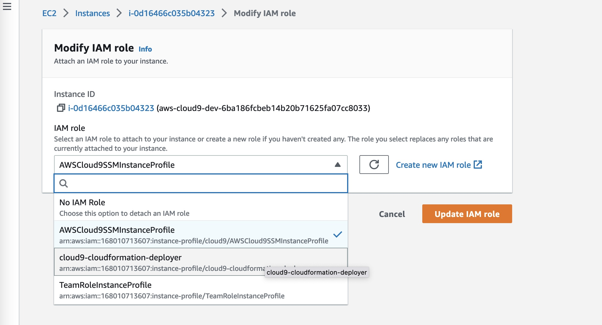

Click `Update IAM Role`

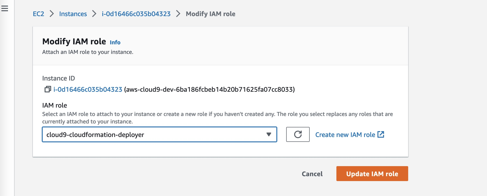

### Prepare Credentials

disabling AWS managed temporary credentials for Cloud9

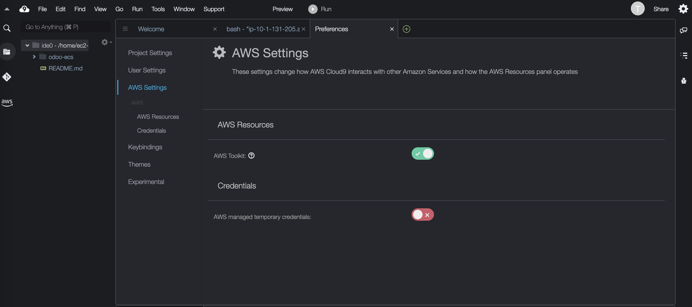

To ensure temporary credentials aren’t already in place we will remove any existing credentials file.

```
rm -vf ${HOME}/.aws/credentials
```

We should configure our aws cli with our current region as default.

```
echo "export AWS_DEFAULT_REGION=$(curl -s 169.254.169.254/latest/dynamic/instance-identity/document | jq -r .region)" >> ~/.bashrc
echo "export AWS_REGION=\$AWS_DEFAULT_REGION" >> ~/.bashrc
echo "export AWS_ACCOUNT_ID=$(aws sts get-caller-identity --query Account --output text)" >> ~/.bashrc
source ~/.bashrc
```