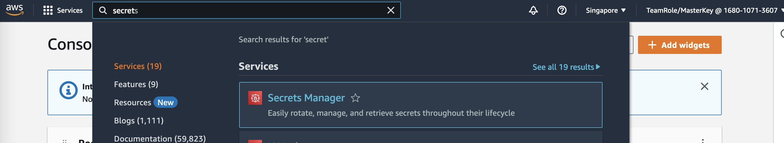
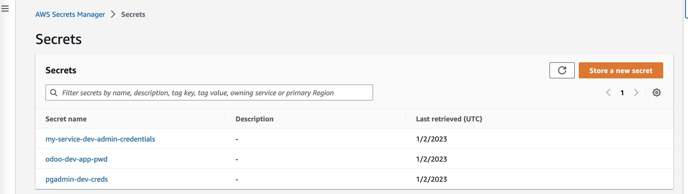
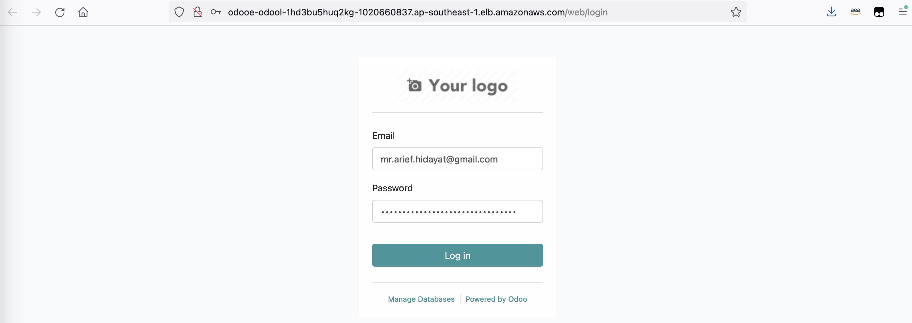
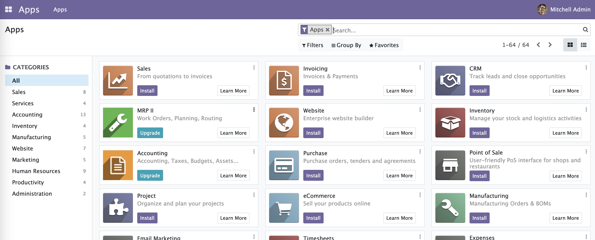

## Context

We have prepared [git repo](https://github.com/arief-hidayat/odoo-ecs) which contains [CDK](https://aws.amazon.com/cdk/) project.

## Prepare Repo

Clone repo

```
git clone https://github.com/arief-hidayat/odoo-ecs.git
cd odoo-ecs/
npm install
cdk bootstrap

```

Open file `odoo-ecs/lib/odoo-ecs-stack.ts`


Edit email and VPC name. firstTime to `true`

```
    const emailAddress = 'mr.arief.hidayat@gmail.com';
    ...
    const firstTime = false;
    ...
    const vpc = ec2.Vpc.fromLookup(this, 'dev-vpc', {vpcName: 'AriefhInfraStack/dev-vpc'});
```

generate cloudformation template 

```
cdk synth
```

### Deploy
deploy

```
cdk deploy
```
see CloudFormation in progress


First time setup will take longer time for Database


Wait until completed


### Verify

Go to `Secrets Manager`



Click `odoo-dev-app-pwd`, scroll down a bit and click `Retrieve Secret Value`.



Open Odoo URL from CloudFormation output `OdooEcsStack.odooLoadBalancer` and login using email and password from the secret.


Now we are logged into Odoo



