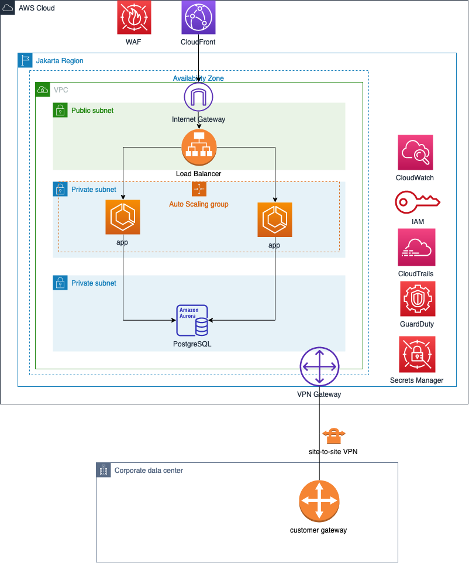

# Containerized Odoo on AWS

## Context

We are going to deploy Odoo container on AWS ECS (Elastic Container Services).

Here's the architecture.

We'll focus on container with DB access in private subnet exposed via load balancer.

## Setup

Follow these steps:
* [prepare VPC](./00-setup-vpc.md) 
* [setup Cloud9 environment](./01-setup-cloud9.md)
* [deploy Infrastructure as Code](./02-deploy-cloudformation.md)
